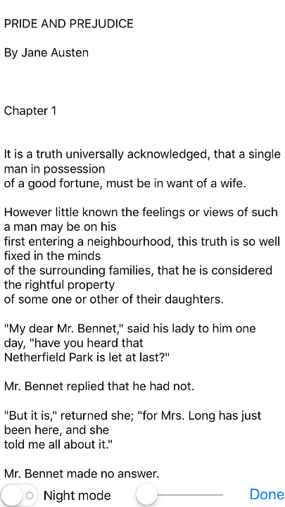
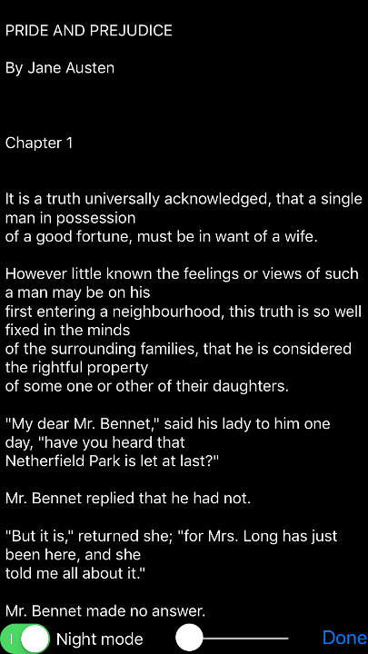
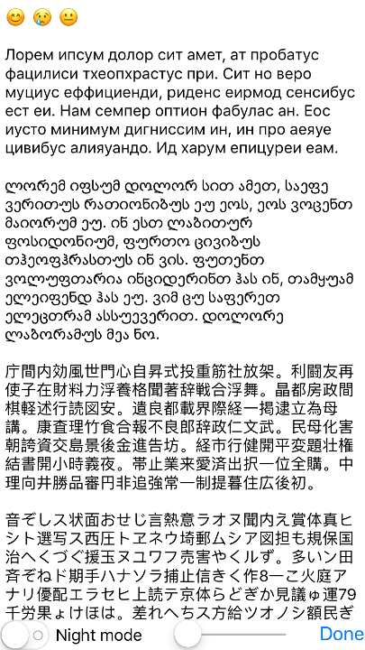

# tinylibrary

tinylibrary™ is a simple EBook reader that is extremely lightweight and minimalistic.

It currently supports Dark Mode, Autoscrolling, and automatic encoding detection.

## Download

tinylibrary is available for free in the app store.

## Features
### Normal Mode

### Dark Mode

### Autoscrolling

### Encoding Detection

## Other

It aims to use the absolute minimum amount of power via efficient resource management to let you enjoy your reading experience for the longest possible time.

tinylibrary™ pledges to be forever Ad-Free.

Email me at tinylibrary@scott-liu.com if you wish to request additional features or if you encounter any problems.
